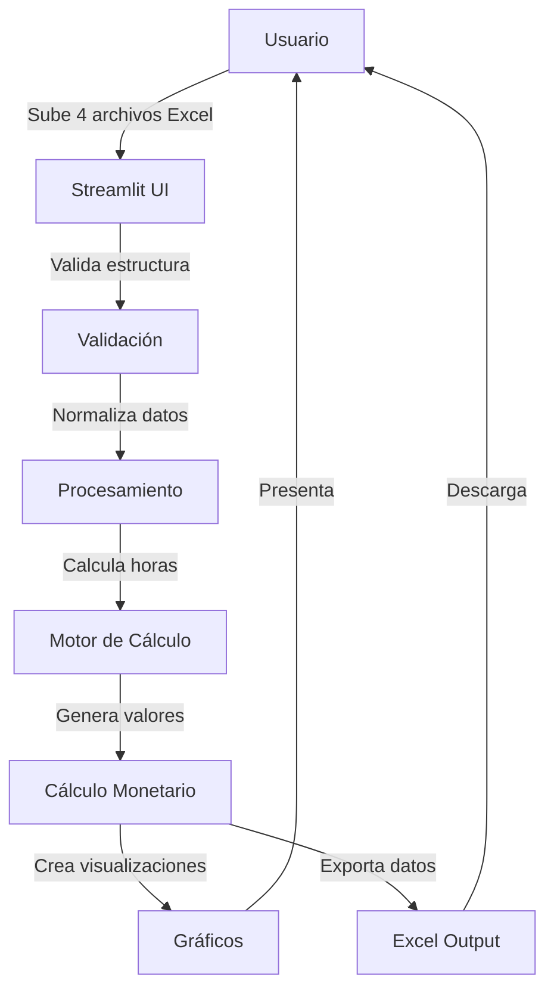

# 🛠️ Documentación Técnica - Desarrollo

## 📐 Arquitectura del Sistema

### Stack Tecnológico
```
Frontend: Streamlit 1.28+
Backend: Python 3.8+
Procesamiento: Pandas 2.0+, NumPy 1.24+
Exportación: Openpyxl 3.1+
Visualización: Matplotlib 3.7+
```

### Flujo de Datos



---

## 🔧 Estructura del Código

### Módulos Principales

```python
app.py
├── Configuración UI (Streamlit)
├── Carga y Validación de Archivos
├── Normalización de Datos
├── Motor de Cálculo
│   ├── obtener_horarios_turno()
│   ├── es_horario_nocturno()
│   ├── calcular_horas_extras_y_recargo()
│   └── calcular_trabajo_real()
├── Cálculo Monetario
├── Visualizaciones
└── Exportación
```

---

## 🧮 Funciones Clave

### 1. `es_horario_nocturno(hora)`
Determina si una hora está en horario nocturno (19:00 - 06:00).

**Parámetros:**
- `hora` (time): Objeto time para evaluar

**Retorna:**
- `bool`: True si está en horario nocturno

**Lógica:**
```python
return hora >= time(19, 0) or hora < time(6, 0)
```

**Casos especiales:**
- Si recibe datetime, extrae solo la hora
- Compara solo las horas, ignora la fecha completa

---

### 2. `calcular_horas_extras_y_recargo(row)`
Función principal que calcula los tres tipos de horas.

**Parámetros:**
- `row` (pd.Series): Fila del DataFrame con datos del registro

**Retorna:**
- `tuple`: (horas_extra_diurna, horas_extra_nocturna, recargo_nocturno)

**Algoritmo:**

#### Paso 1: Calcular Recargo Nocturno
```python
# Intersección de jornada normal con horario nocturno
inicio_trabajo = max(hora_entrada_esperada, ingreso_real)
fin_trabajo = min(hora_salida_esperada, salida_real)

# Verificar segmento 19:00-23:59
if fin_trabajo > inicio_noche:
    inicio_recargo = max(inicio_trabajo, inicio_noche)
    fin_recargo = fin_trabajo
    recargo_nocturno += (fin_recargo - inicio_recargo).total_seconds() / 3600

# Verificar segmento 00:00-06:00
if fin_trabajo > medianoche and inicio_trabajo < fin_noche_dia_sig:
    inicio_recargo = max(inicio_trabajo, medianoche)
    fin_recargo = min(fin_trabajo, fin_noche_dia_sig)
    recargo_nocturno += (fin_recargo - inicio_recargo).total_seconds() / 3600
```

#### Paso 2: Calcular Extras por Llegada Anticipada
```python
if ingreso_real < hora_entrada_esperada:
    tiempo_antes = (hora_entrada_esperada - ingreso_real).total_seconds() / 3600
    
    if es_horario_nocturno(hora_ingreso):
        if hora_ingreso < time(6, 0):
            # Madrugada (00:00-06:00)
            if hora_entrada <= time(6, 0):
                horas_extra_nocturna += tiempo_antes
            else:
                # Split en límite de 06:00
                limite_6am = datetime.combine(row["FECHA"], time(6, 0))
                nocturno = (limite_6am - ingreso_real).total_seconds() / 3600
                diurno = (hora_entrada_esperada - limite_6am).total_seconds() / 3600
                horas_extra_nocturna += max(nocturno, 0)
                horas_extra_diurna += max(diurno, 0)
        else:
            # Noche (19:00-23:59)
            horas_extra_nocturna += tiempo_antes
    else:
        # Diurno
        horas_extra_diurna += tiempo_antes
```

#### Paso 3: Calcular Extras por Salida Tardía
```python
if salida_real > hora_salida_esperada:
    tiempo_actual = hora_salida_esperada
    
    while tiempo_actual < salida_real:
        hora_del_dia = tiempo_actual.time()
        
        if es_horario_nocturno(hora_del_dia):
            # Determinar fin del segmento nocturno
            if hora_del_dia >= time(19, 0):
                fin_segmento_noche = datetime.combine(tiempo_actual.date(), time(23, 59, 59))
            else:
                fin_segmento_noche = datetime.combine(tiempo_actual.date(), time(6, 0))
            
            fin_segmento = min(fin_segmento_noche, salida_real)
            horas_extra_nocturna += (fin_segmento - tiempo_actual).total_seconds() / 3600
            tiempo_actual = fin_segmento
        else:
            # Segmento diurno
            fin_segmento_dia = datetime.combine(tiempo_actual.date(), time(19, 0))
            fin_segmento = min(fin_segmento_dia, salida_real)
            horas_extra_diurna += (fin_segmento - tiempo_actual).total_seconds() / 3600
            tiempo_actual = fin_segmento
```

---

### 3. `calcular_trabajo_real(row)`
Calcula las horas efectivamente trabajadas con descuento de almuerzo.

**Parámetros:**
- `row` (pd.Series): Fila del DataFrame

**Retorna:**
- `float`: Horas trabajadas

**Lógica:**
```python
total = (salida - ingreso).total_seconds() / 3600

if dia < 5:  # Lunes a Viernes
    return total - 1
else:  # Sábados y Domingos
    return total
```

---

## 💾 Gestión de Precisión

### Problema: Pérdida de Precisión por Redondeo Prematuro

**Incorrecto:**
```python
# ❌ Redondear antes de calcular valores monetarios
df["HORAS EXTRA DIURNA"] = df["HORAS EXTRA DIURNA"].round(2)
df["VALOR EXTRA DIURNA"] = df["HORAS EXTRA DIURNA"] * df["IMPORTE HORA"] * factor

# Ejemplo:
# 0.8333333 → round(2) → 0.83
# 0.83 × $20,000 × 1.25 = $20,750 ❌ PÉRDIDA: $83.33
```

**Correcto:**
```python
# ✅ Mantener precisión completa durante cálculos
df["HORAS EXTRA DIURNA"] = calcular_sin_redondear()  # 0.8333333...
df["VALOR EXTRA DIURNA"] = df["HORAS EXTRA DIURNA"] * df["IMPORTE HORA"] * factor

# Solo después crear columnas de visualización
df["HORAS EXTRA DIURNA_DISPLAY"] = df["HORAS EXTRA DIURNA"].round(2)

# Ejemplo:
# 0.8333333 × $20,000 × 1.25 = $20,833.33 ✅ EXACTO
```

### Estrategia Implementada

```python
# 1. Calcular con precisión completa
resultados = df.apply(calcular_horas_extras_y_recargo, axis=1)
df["HORAS EXTRA DIURNA"] = [r[0] for r in resultados]  # Sin redondear

# 2. Calcular valores monetarios con precisión completa
df["VALOR EXTRA DIURNA"] = df.apply(
    lambda row: row["HORAS EXTRA DIURNA"] * row["IMPORTE HORA"] * factor,
    axis=1
)

# 3. Redondear valores monetarios (resultado final)
df["VALOR EXTRA DIURNA"] = df["VALOR EXTRA DIURNA"].round(2)

# 4. Crear columnas display para visualización
df["HORAS EXTRA DIURNA_DISPLAY"] = df["HORAS EXTRA DIURNA"].round(2)
```

---

## 📊 Exportación a Excel

### Proceso de Creación

```python
from openpyxl import Workbook
from openpyxl.styles import Font, Alignment, Border, Side

# 1. Crear workbook
wb = Workbook()
ws = wb.active

# 2. Escribir encabezados
headers = [...]
ws.append(headers)

# 3. Aplicar estilos a encabezados
header_font = Font(bold=True, size=11)
border = Border(...)

for cell in ws[1]:
    cell.font = header_font
    cell.alignment = Alignment(horizontal="center", vertical="center")
    cell.border = border

# 4. Escribir datos fila por fila
for idx, row in df.iterrows():
    row_data = []
    for header in headers:
        value = row[column_mapping[header]]
        # Convertir tipos numpy a tipos Python nativos
        if isinstance(value, (np.float64, np.float32)):
            row_data.append(float(value))  # Sin redondear
        # ... otros tipos
    ws.append(row_data)

# 5. Aplicar formatos numéricos
for row_idx in range(2, ws.max_row + 1):
    for col_idx in range(1, len(headers) + 1):
        cell = ws.cell(row=row_idx, column=col_idx)
        
        if "VALOR" in headers[col_idx - 1]:
            cell.number_format = '#,##0.00'  # $1,234.56
        elif "Cant." in headers[col_idx - 1]:
            cell.number_format = '0.00'  # 1.25
```

### Mapeo de Columnas

```python
column_mapping = {
    "CÉDULA": "CÉDULA",                              # Del input_datos
    "NOMBRE": "NOMBRE",                              # Del base_empleados
    "CARGO": "CARGO",                                # Del base_empleados
    "hora_real_INGRESO": "HRA INGRESO",              # Nombre display vs interno
    "Cant. HORAS EXTRA DIURNA": "HORAS EXTRA DIURNA", # Valores sin redondear
    # ...
}
```

---

## 🔍 Validaciones Implementadas

### 1. Validación de Estructura de Archivos

```python
# Columnas obligatorias de input_datos
columnas_input = ["CÉDULA", "FECHA", "HRA INGRESO", "HORA SALIDA", "TURNO"]

# Columnas obligatorias de base_empleados
columnas_empleados = ["CEDULA", "NOMBRE", "AREA", "SALARIO BASICO"]

# Verificar existencia
for col in columnas_requeridas:
    if col not in df.columns:
        st.error(f"Falta columna: {col}")
        st.stop()
```

### 2. Validación de Formatos

```python
# Fechas
df["FECHA"] = pd.to_datetime(df["FECHA"], errors='coerce')
if df["FECHA"].isna().any():
    st.error("Fechas con formato incorrecto")
    st.stop()

# Horas
def convertir_a_time(valor):
    if isinstance(valor, time):
        return valor
    if isinstance(valor, datetime):
        return valor.time()
    # ... más conversiones
    
df["HRA INGRESO"] = df["HRA INGRESO"].apply(convertir_a_time)
```

### 3. Validación de Coincidencias

```python
# Merge y verificación
df = df_input.merge(df_empleados, left_on=cedula_input, 
                     right_on=cedula_empleados, how="left")

empleados_sin_info = df[df["NOMBRE"].isna()]
if len(empleados_sin_info) > 0:
    st.warning(f"{len(empleados_sin_info)} registros sin información")
    st.warning(f"Cédulas: {empleados_sin_info[cedula_input].unique()[:5]}")
```

---

## 🎨 Visualizaciones

### Gráficos con Matplotlib

```python
# Gráfico de barras apiladas
fig, ax = plt.subplots(figsize=(10, 6))
empleado_stats.plot(kind='bar', ax=ax, 
                    color=['#f37021', '#ff6600', '#ff9966'], 
                    stacked=True)
ax.set_ylabel("Horas")
ax.set_xlabel("Empleado")
ax.legend(["Extra Diurna", "Extra Nocturna", "Recargo Nocturno"])
plt.xticks(rotation=45, ha='right')
plt.tight_layout()
st.pyplot(fig)
```

### Exportación de Gráficos

```python
# Guardar en buffer
buf = BytesIO()
fig.savefig(buf, format='png', dpi=300, bbox_inches='tight')
buf.seek(0)

# Botón de descarga
st.download_button(
    label="📊 Descargar gráfico",
    data=buf,
    file_name=f"grafico_{date.today().isoformat()}.png",
    mime="image/png"
)
```

---

## 🧪 Testing y Debugging

### Casos de Prueba Recomendados

```python
# Test 1: Llegada anticipada diurna
test_case_1 = {
    "turno": "08:45-18:10",
    "real": "07:30-18:10",
    "esperado": {"extra_diurna": 1.25, "extra_nocturna": 0, "recargo": 0}
}

# Test 2: Salida tardía nocturna
test_case_2 = {
    "turno": "08:45-18:10",
    "real": "08:45-20:00",
    "esperado": {"extra_diurna": 0.83, "extra_nocturna": 1.0, "recargo": 0}
}

# Test 3: Turno con recargo
test_case_3 = {
    "turno": "14:00-22:00",
    "real": "14:00-22:00",
    "esperado": {"extra_diurna": 0, "extra_nocturna": 0, "recargo": 3.0}
}

# Test 4: Combinado
test_case_4 = {
    "turno": "14:00-22:00",
    "real": "13:00-23:30",
    "esperado": {"extra_diurna": 1.0, "extra_nocturna": 1.5, "recargo": 3.0}
}
```

### Debugging

```python
# Agregar logs temporales
import logging

logging.basicConfig(level=logging.DEBUG)
logger = logging.getLogger(__name__)

def calcular_horas_extras_y_recargo(row):
    logger.debug(f"Processing row: {row['NOMBRE']}")
    logger.debug(f"Ingreso: {row['DT_INGRESO']}, Salida: {row['DT_SALIDA']}")
    
    # ... cálculos
    
    logger.debug(f"Result - Diurna: {horas_extra_diurna}, "
                f"Nocturna: {horas_extra_nocturna}, "
                f"Recargo: {recargo_nocturno}")
```

---

## 🔐 Consideraciones de Seguridad

### Validación de Entrada
```python
# Sanitizar cédulas
df[cedula_input] = df[cedula_input].astype(str).str.strip()

# Validar tipos de datos
assert df["SALARIO BASICO"].dtype in [np.int64, np.float64], "Salario debe ser numérico"
```

### Manejo de Datos Sensibles
```python
# NO mostrar información sensible en logs
logger.debug(f"Processing employee: {row['CÉDULA'][:3]}***")  # Enmascarar
```

---

## 📦 Deployment

### Requisitos para Producción

```bash
# requirements.txt
streamlit==1.28.0
pandas==2.0.3
numpy==1.24.3
openpyxl==3.1.2
matplotlib==3.7.2
```

### Configuración Streamlit

```toml
# .streamlit/config.toml
[server]
maxUploadSize = 200
enableXsrfProtection = true

[theme]
primaryColor = "#f37021"
backgroundColor = "#FFFFFF"
secondaryBackgroundColor = "#F0F2F6"
textColor = "#262730"
font = "sans serif"
```

### Variables de Entorno

```bash
# .env (NO incluir en Git)
STREAMLIT_SERVER_PORT=8501
STREAMLIT_SERVER_ADDRESS=0.0.0.0
```

---

## 🚀 Mejoras Futuras

### Optimizaciones Planificadas

1. **Performance**
   - Vectorizar cálculos con NumPy
   - Cachear archivos de configuración
   - Procesamiento paralelo para datasets grandes

2. **Funcionalidad**
   - Soporte para festivos
   - Cálculo de dominicales
   - Historial de procesamiento
   - API REST para integración

3. **UX**
   - Preview antes de exportar
   - Validación en tiempo real
   - Tooltips interactivos
   - Modo oscuro

---

## 📚 Referencias

### Normativa Colombiana
- Código Sustantivo del Trabajo - Artículos 160-168
- Ley 2101 de 2021 (Reducción jornada laboral)
- Decreto 1072 de 2015

### Recursos Técnicos
- [Streamlit Documentation](https://docs.streamlit.io/)
- [Pandas Documentation](https://pandas.pydata.org/docs/)
- [Openpyxl Documentation](https://openpyxl.readthedocs.io/)

---

**Versión**: 2.0  
**Última actualización**: Febrero 2026  
**Mantenedor**: Equipo de Desarrollo Fertrac
